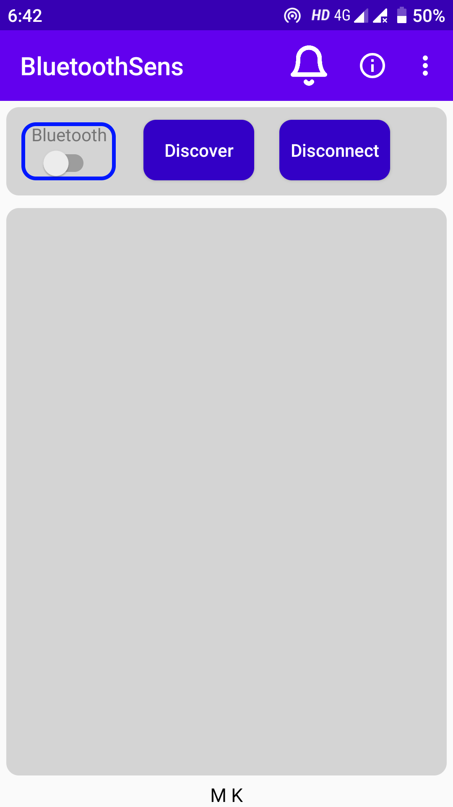
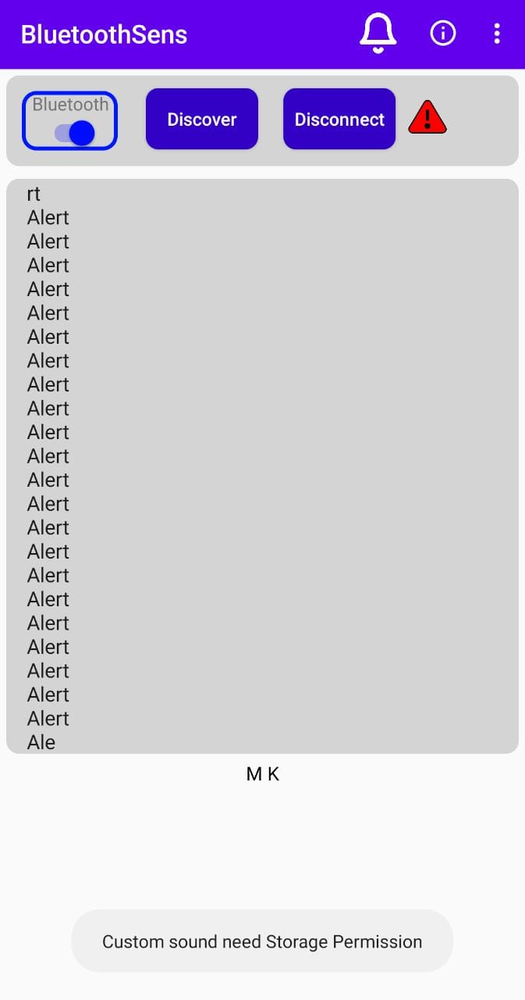

This is Bluethooth terminal baised application where it uses bluethooth sensor and take the data from arduino
uno and display in this application.It is cooded for ultrasonic sensor where it set for an alarm when any object comes in the
range of 30 cm near to the ultrasonic sensor. This application will alarm when the data received in application
is specific word as "alert" or "Alert" or "ALERT".

 

 

